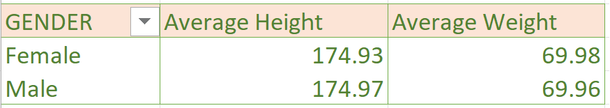
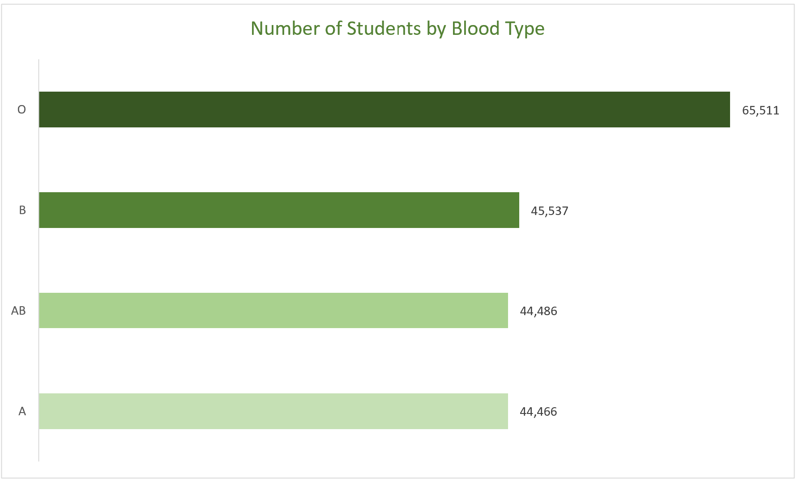

# BOSTON UNIVERSITY

## Introduction
#### Boston University is a private university accepting students for the new academic session into different faculties. The data shown in this analysis was collected from prospective students as they filled the online registration form.  The purpose of this analysis is to determine the state of health of the students which could be used in case of emergency and also for record and research purposes.
---
---

## Features used in the analysis
#### Formulas and Conditional statements as well as pivot tables were used for the breakdown of data. The data was further presented using graphical features for a more concise analysis.

## Objectives
#### 1.	To determine the average Height and Weight of the Male and female students. 
#### 2.	To determine the number and percentage of students who smoke and who don’t.
#### 3.	To determine the number of students with the diffrent Blood Types.
#### 4.	To determine the number of students who has diabetes and who students who don’t.
#### 5.	To determine the Average Age, Average Body Mass Index (BMI), Average Temperature, Average Heart Rate, Average Blood Pressure, Average Cholesterol of the students.
---

Ave. Height & Weight on Pivot Table                 | 		Ave. Height & Weight on Chart
:---------------------------------------------:	         |		:----------------------------------------:
 	         | 		
Smokers and Nonsmokers on Pivot Table         | 		Smokers and Nonsmokers on Chart
 			         |		
Number of students by Blood type on Pivot    | 		Number of students by Blood type on Chart
 		          |			 
Diabetic & Non-Diabetic on Pivot Table             | 		Diabetic & Non-Diabetic on Chart
 			         |			 
Ave. Age, BMI, Temp, Heart Rate, Blood Pressure, Cholesterol on Pivot Table   | 		Ave. Age, BMI, Temp, Heart Rate, Blood Pressure, Cholesterol on Chart
 			         |			 
---
---
# Observations 

### The above data shows that; 
#### The average height and weight between the Males and Females are almost at the same level.
#### In the Smokers and Nonsmokers data there are students who did not specify which category they belong to and the number of those students are higher than that of those who don’t smoke, thereby making our analysis far from being accurate.
#### The blood type “O” has the highest number of students.
#### There are also records of students who did not specify if they have diabetes or not and this also makes our analysis inaccurate
#### The figures on other data such as the Average Age, Body Mass Index (BMI), Temperate, Heart Rate, Blood Pressure and Cholesterol are at almost the same level between the Male and Female students.
---
---
# Comments
#### Students who did not specify if they are smokers or not and students who did not specify if they have diabetes or not should be made to login into their school portal and complete the Forms so as to get a concise figure on both categories.
---
---

